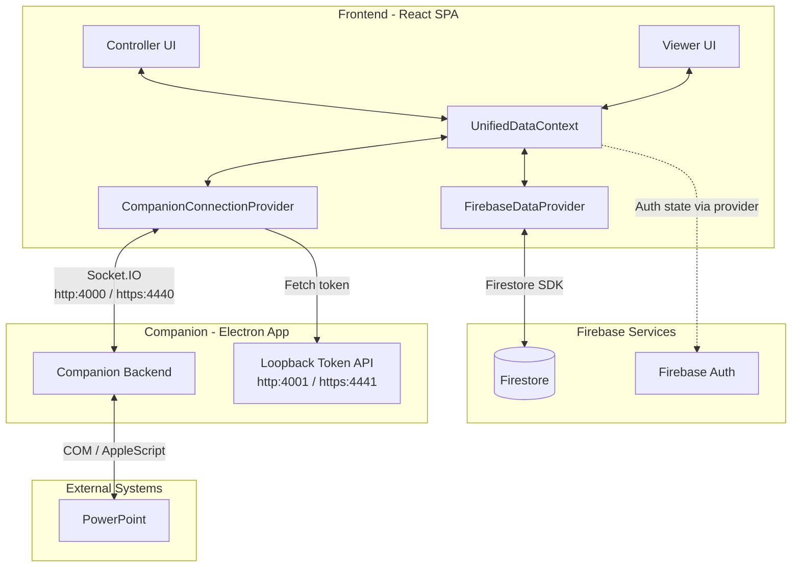

# System Context

**Verified against files:**
- `/Users/radhabalagopala/Dev/OnTime/frontend/src/context/AppModeContext.tsx`
- `/Users/radhabalagopala/Dev/OnTime/frontend/src/context/UnifiedDataContext.tsx`
- `/Users/radhabalagopala/Dev/OnTime/frontend/src/context/CompanionConnectionContext.tsx`
- `/Users/radhabalagopala/Dev/OnTime/frontend/src/context/FirebaseDataContext.tsx`

**Last verified:** 2026-02-06

---

## Component Overview

## Operation Modes

`AppModeContext` drives `mode` and `effectiveMode`, and `UnifiedDataContext` arbitration resolves the active source per room.

- **auto**: prefers Companion when connected; otherwise Cloud. During close timestamp races, authority/tie-breakers and confidence windows apply.
- **local**: local-biased arbitration (Companion favored on close timestamps/ties), but Cloud can still be selected when fresher.
- **cloud**: cloud-biased arbitration, but Companion can still be selected when it has clearly fresher state.

In short: modes are **biases for arbitration**, not absolute hard locks.

---

## Assumptions / Limits

- **UI Scope**: High-level orchestration only; not all React components are shown.
- **Electron Internals**: Main/renderer separation is abstracted as "Companion Backend."
- **Networking**: LAN subnet and discovery details are intentionally omitted.
- **Schema**: Firestore subcollections (`timers`, `state`, `liveCues`, etc.) are abstracted into one node.
- **Auth Flow**: Provider-level token/auth refresh details are abstracted.
- **Security**: Token API is expected to remain loopback-restricted.
