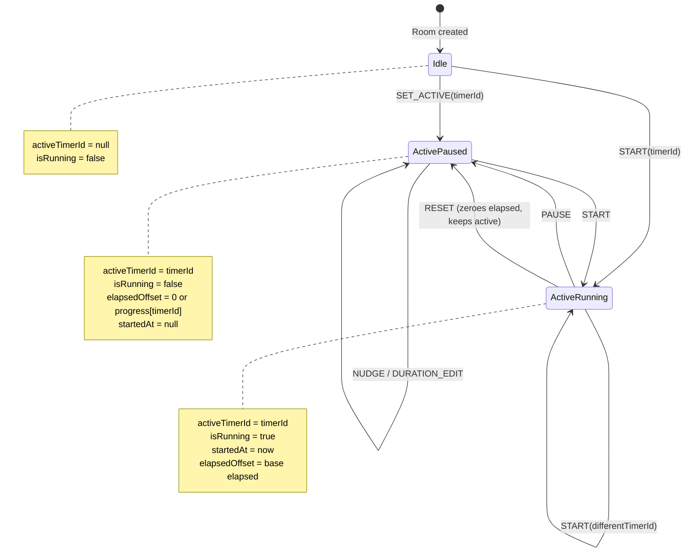
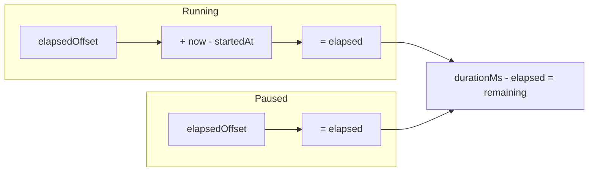

# Timer Lifecycle

**Verified against files:**
- `docs/timer-logic.md` (authoritative spec)
- `frontend/src/utils/timer-utils.ts` (elapsed calculations)
- `frontend/src/types/index.ts` (Timer, RoomState types)

**Last verified:** 2026-02-06

---

## State Machine

## Elapsed Time Calculation

## Key Invariants

| Action | Updates to RoomState |
|--------|---------------------|
| START | `activeTimerId`, `isRunning=true`, `startedAt=now`, `elapsedOffset`, `progress[old]`, `currentTime`, `lastUpdate` |
| PAUSE | `isRunning=false`, `startedAt=null`, `elapsedOffset=elapsed`, `progress[active]=elapsed`, `currentTime`, `lastUpdate` |
| RESET | `isRunning=false`, `startedAt=null`, `elapsedOffset=0`, `progress[active]=0`, `currentTime=0`, `lastUpdate`; restores `originalDuration` if set |
| SET_ACTIVE | `activeTimerId`, `isRunning=false`, `elapsedOffset=progress[id]`, `currentTime`, `lastUpdate` |
| NUDGE | Modifies `timer.duration` (not elapsed); sets `originalDuration` on first nudge |
| DURATION_EDIT | Resets `progress[id]=0`; if active: `elapsedOffset=0`, `currentTime=0`, `lastUpdate=now` |

---

## Assumptions / Limits

1. **Elapsed can be negative** — represents "bonus time" added via nudge. Do NOT clamp.
2. **Single active timer per room** — `activeTimerId` is singular.
3. **Progress map is authoritative for non-active timers** — `progress[timerId]` stores paused elapsed.
4. **Nudge adjusts duration, not elapsed** — for reliable cross-browser sync via timer doc path.
5. **Duration edit always resets progress** — changing duration gives a fresh start.
6. **Diagram does not cover:** multi-controller arbitration, offline queue replay, staleness detection.
