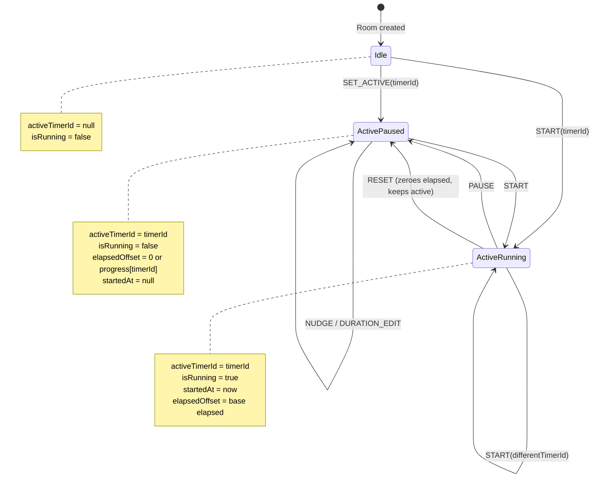
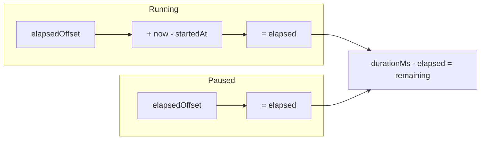

# Timer Lifecycle

**Verified against files:** [`docs/app-prd.md`, `docs/client-prd.md`, `docs/cloud-server-prd.md`, `docs/edge-cases.md`, `docs/interface.md`, `docs/local-mode.md`, `docs/local-offline-lan-plan.md`, `docs/local-server-prd.md`, `docs/phase-3-decisions.md`, `docs/phase-3-tasklist.md`, `docs/timer-logic.md`, `frontend/src/context/FirebaseDataContext.test.ts`, `frontend/src/context/FirebaseDataContext.tsx`, `frontend/src/context/firebase-timer-state-utils.ts`]

**Last verified:** 2026-02-06

---

## State Machine



## Elapsed Time Calculation



## Migration Lifecycle (Legacy v1 -> v2)

```mermaid
flowchart LR
    L1[legacy room.state] --> L2[buildMigrationTimerTuple legacyState now]
    L2 --> L3[derive elapsedOffset from active progress if present]
    L2 --> L4[currentTime = elapsed ms at lastUpdate]
    L2 --> L5[full tuple returned:
activeTimerId, isRunning,
startedAt, elapsedOffset,
currentTime, lastUpdate, progress]
    L5 --> L6[batch.set rooms/{roomId}/state/current merge true]
```

## Key Invariants

| Action | Updates to RoomState |
|--------|---------------------|
| START | Writes full tuple: `activeTimerId`, `isRunning=true`, `startedAt=now`, `elapsedOffset`, `progress`, `currentTime`, `lastUpdate` |
| PAUSE | Writes full tuple: `activeTimerId` (unchanged), `isRunning=false`, `startedAt=null`, `elapsedOffset=elapsed`, `progress[active]=elapsed`, `currentTime=elapsed`, `lastUpdate=now` |
| RESET | Writes full tuple: `activeTimerId` (unchanged), `isRunning=false`, `startedAt=null`, `elapsedOffset=0`, `progress[active]=0`, `currentTime=0`, `lastUpdate=now`; restores `originalDuration` if set |
| SET_ACTIVE | Writes full tuple: `activeTimerId=id`, `isRunning=false`, `startedAt=null`, `elapsedOffset=progress[id]`, `progress`, `currentTime=elapsedOffset`, `lastUpdate=now` |
| NUDGE | Modifies `timer.duration` only (not elapsed/currentTime); sets `originalDuration` on first nudge |
| DURATION_EDIT | Resets `progress[id]=0`; if active writes `elapsedOffset=0`, `currentTime=0`, `lastUpdate=now`, `startedAt=(isRunning ? now : null)` |
| MIGRATE_V1_TO_V2 | `buildMigrationTimerTuple` writes full tuple to `rooms/{roomId}/state/current` with `currentTime` in milliseconds at `lastUpdate` |

---

## Assumptions / Limits

1. **Elapsed can be negative** — represents "bonus time" added via nudge. Do NOT clamp.
2. **Single active timer per room** — `activeTimerId` is singular.
3. **Progress map is authoritative for non-active timers** — `progress[timerId]` stores paused elapsed.
4. **Nudge adjusts duration, not elapsed** — for reliable cross-browser sync via timer doc path.
5. **Duration edit always resets progress** — changing duration gives a fresh start.
6. **`currentTime` is milliseconds** — mirrors elapsed-at-`lastUpdate` (not seconds).
7. **Timer mutations must keep tuple coherence** — do not update only one anchor field.
8. **Diagram does not cover:** multi-controller arbitration, offline queue replay, staleness detection.
