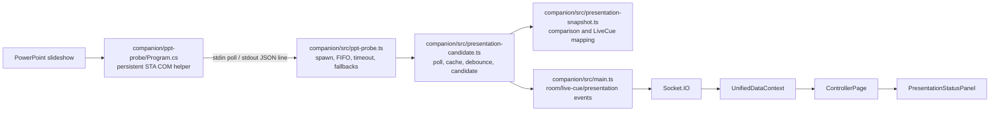

# Standalone PowerPoint Video Timer — Execution Plan

**Baseline:** `fceb200b05c8f3bf7253ac0b3a91d613cc0bd305` (2026-07-18)
**Prepared:** 2026-07-23
**Scope:** planning only; Windows private beta first

## 1. Goal and decisions

Add a compact Windows utility at `apps/ppt-timer` that observes a running Microsoft PowerPoint slideshow and shows slide and embedded-video timing. It must consume the same canonical PowerPoint capability as Companion; it is not a controller, room client, or second implementation of PowerPoint logic.

### Decisions

1. **Use Electron for the application shell and keep .NET only for the existing COM helper.** The repository already builds Electron/NSIS desktop products (`companion/package.json:1-54`, `controller/package.json:20-91`) and has hardened `BrowserWindow`, preload, display, and persistence patterns (`controller/src/main.ts:35-160,295-460`). A WPF/WinUI UI would add a second UI, installer, settings, and release stack without removing the need to preserve the existing TypeScript consumers.
2. **Place the app at `apps/ppt-timer` now.** That is the documented target and already has standalone dependency rules (`docs/rebuild-architecture.md:95-111`, `.dependency-cruiser.cjs:54-63`). Add only `apps/*` to the root workspaces; do not migrate any existing application.
3. **Create `packages/ppt-bridge` as the single native boundary.** Move—not copy—the C# source/project there. It owns the helper protocol, runtime validation, executable discovery inputs, supervised process lifecycle, timeouts, restart, and shutdown.
4. **Expand `packages/presentation-core` only with pure PowerPoint presentation state.** It owns validated-result normalization, snapshot equality, current cache/debounce/stale-clearing behavior, and primary-video identity projection. It must remain independent of Electron, child processes, rooms, transports, and `LiveCue`.
5. **The standalone Electron main process polls PowerPoint directly through the shared bridge/session API.** It never imports Companion code and never uses Socket.IO, Firebase, rooms, pairing, local sync, or `UnifiedDataContext`.
6. **Companion adopts the shared packages through compatibility wrappers.** Existing exported functions, PowerShell/macOS fallbacks, 1-second cadence, 600 ms debounce, two-poll video clearing, event payloads/order, capability gates, and shutdown order remain stable.
7. **Preserve the working helper before production hardening.** Electron `31.7.4` and `.NET 6` describe the proven baseline, not an approved 2026 release stack. First move and wrap the helper without COM or payload changes. Later, as an isolated packaging step before customer distribution, pin a supported Electron/electron-builder pair and retarget the same helper to self-contained, untrimmed **.NET 10 LTS**, then verify contract parity against the frozen working fixtures. .NET 6 support ended in 2024; .NET 10 is supported through November 2028 ([Microsoft lifecycle](https://learn.microsoft.com/en-us/lifecycle/products/microsoft-net-and-net-core)).

## 2. Current PowerPoint architecture and runtime path

### Current data flow



### Exact execution path

1. **COM helper:** `Program.Main` is `[STAThread]`, reads `poll`/`exit`, serializes one JSON object per poll, and flushes stdout (`companion/ppt-probe/Program.cs:10-40`). `Program.Poll` (`Program.cs:42-282`) detects `POWERPNT`, records foreground/background state and a selected PID, attaches with `GetActiveObject("PowerPoint.Application")`, reads slideshow/presentation/slide fields, recursively collects media shapes, normalizes media length/current-position units, derives status/remaining, emits `videos[]` and `editSlideVideos[]`, and fills scalar primary fields. The primary candidate is initially the first media item and is replaced/locked by the first actively playing item (`Program.cs:180-279`). COM reflection helpers are at `Program.cs:289-417`.
2. **Line protocol and native lifecycle:** `resolvePptProbePath`, `ensurePptProbeHelper`, `pollPowerPointViaNativeHelper`, and `stopPptProbeHelper` live at `companion/src/ppt-probe.ts:35-145`. Packaged discovery uses `process.resourcesPath/bin/ppt-probe.exe`; development uses `companion/bin`. The host maintains a FIFO pending queue, parses a stdout line as JSON, and resolves `null` after an 8-second timeout or failure.
3. **Fallbacks:** `stopPowerPointHelper`, `ensurePowerPointHelper`, and `pollPowerPointViaHelper` (`ppt-probe.ts:157-250`) supervise the persistent PowerShell STA fallback. `fetchPowerPointStatus` (`ppt-probe.ts:252-1017`) selects AppleScript on macOS and native-first → persistent PowerShell → one-shot PowerShell on Windows. The fallback script has broader debug and media-source probing than the C# helper; this is a compatibility path, not a second surface for the standalone app.
4. **Raw TypeScript contract:** `PowerPointPollResult` currently types `state`, slideshow/presentation identity, `videoDetected`, scalar video timing, `videos[]`, `editSlideVideos[]`, and `videoTimingUnavailable` (`companion/src/presentation-snapshot.ts:21-50`). It does not type native `pptActive`, `pptError`, or per-video `status`, and JSON is not runtime-validated.
5. **Candidate and state behavior:** constants are `PPT_POLL_INTERVAL_MS = 1000`, `PPT_DEBOUNCE_MS = 600`, and `PPT_VIDEO_CLEAR_POLLS = 2` (`companion/src/presentation-candidate.ts:67-69`). `handlePowerPointStatus` (`presentation-candidate.ts:153-323`) handles missing/none/no-slideshow results, title and slide fallback, per-slide video cache, `videos` → `editSlideVideos` → cache precedence, explicit-no-video counters, elapsed-delta playing inference, and scalar carry-forward. `updatePresentationCandidate` (`:125-151`) debounces identity changes but commits timing changes for an already announced identity immediately. `commitPresentationSnapshot` (`:82-123`) chooses create/update/end/clear transitions.
6. **Polling/reentrancy:** `startPowerPointDetection` (`presentation-candidate.ts:325-361`) gates on supported platform and the PowerPoint capability, uses a one-second interval, and protects the loop with `pptPollInFlight`. `stopPowerPointDetectionTimer` is at `:363-367`.
7. **Companion integration:** `configurePresentationCandidate` injects transport callbacks (`presentation-candidate.ts:25-65`; wiring at `companion/src/main.ts:599-609`). `emitLiveCueCreated`, `emitLiveCueUpdated`, `emitLiveCueEnded`, and `emitPresentationLoaded/Update/Clear` persist room state and emit `LIVE_CUE_*` and `PRESENTATION_*` (`main.ts:514-592`). Mode changes start/stop detection and helpers at `main.ts:2481-2487`; startup is at `:2916-2919`; app quit stops both helper paths at `:3102-3103`.
8. **Shared envelopes:** `LiveCue`/video metadata are defined in `packages/shared-types/src/index.ts`; presentation/live-cue event envelopes are defined in `packages/interface-contracts/src/live-cue-envelopes.ts`. `buildPowerPointCue` converts the internal snapshot to that Companion contract and forces timing unavailable on macOS (`presentation-snapshot.ts:105-142`).
9. **Controller:** `UnifiedDataContext` receives presentation events and routes loaded/update through live-cue handling (`frontend/src/context/UnifiedDataContext.tsx:3829-3848`), registers/removes listeners (`:4079-4111`), and merges records with `mergeCueVideos` (`:4390-4413`). `ControllerPage` selects the latest presentation and active cue (`frontend/src/routes/ControllerPage.tsx:496-526`) and renders the status panel (`:2444-2502`). `PresentationStatusPanel` renders missing presentation, slide, timing-unavailable, no-video, ready/playing/paused/ended, and 250 ms end inference (`frontend/src/components/controller/PresentationStatusPanel.tsx:10-133`).

### Established working baseline and residual risks

The native Windows journey is established, demonstrated baseline behavior: the STA helper attaches to PowerPoint, observes the slideshow and slide counts, enumerates embedded media, reports scalar and per-video duration/elapsed/remaining/status, applies the current multiple-video choice, and drives Companion → normalized presentation/live-cue events → the Controller panel. The plan does **not** re-prove COM feasibility, redesign media enumeration, or substitute PowerShell for this path.

Residual behavior to freeze before extraction, not silently rewrite:

- A warm per-slide cache can survive repeated polls with no video payload because cache hydration occurs before the no-payload check; `main.ppt-status.test.ts` D6 pins this behavior.
- Scalar `videoRemaining` can be carried forward while elapsed advances; D10 pins the fallback path.
- `videos[].status`, `pptActive`, and `pptError` exist at runtime but are absent or incomplete in the current TypeScript schema.
- The native and PowerShell probes do not inspect exactly the same sources and may report different timing availability.
- A selected foreground PID can differ from the PowerPoint instance returned by the COM Running Object Table when multiple instances exist.
- FIFO/helper I/O and the poll-loop reentrancy path lack direct unit coverage; the current C/D suites begin at snapshot/candidate boundaries (`docs/rebuild-ninth-milestone-audit.md`).

These are extraction constraints. Existing Companion C/D expectations stay unchanged in this project. Corrections to warm-cache or scalar fallback semantics require a later, separately approved shared-behavior change.

## 3. Proposed architecture

```mermaid
flowchart TB
  subgraph Native[packages/ppt-bridge/native/windows-ppt-probe]
    COM[Program.cs<br/>COM access, raw measurement/status]
  end

  subgraph Bridge[@ontime/ppt-bridge — Node-only]
    SCHEMA[raw protocol schema + validator]
    CLIENT[supervised helper client<br/>FIFO, timeout, generation, restart, close]
    SESSION[PowerPoint session<br/>1 s non-reentrant polling]
  end

  subgraph Core[@ontime/presentation-core — pure]
    NORMAL[normalized presentation state]
    MACHINE[cache, debounce, stale clearing]
    PRIMARY[canonical primary-video reference]
  end

  subgraph Existing[Existing Companion]
    LEGACYPROBE[ppt-probe.ts wrapper<br/>PowerShell/macOS fallback]
    LEGACYCAND[presentation-candidate.ts adapter]
    EVENTS[main.ts room/live-cue emission]
  end

  subgraph App[apps/ppt-timer]
    MAIN[Electron main<br/>window, settings, diagnostics]
    PRELOAD[hardened preload]
    UI[small local renderer]
  end

  COM -->|poll / JSON line| CLIENT --> SCHEMA --> SESSION
  SESSION --> MACHINE --> NORMAL
  NORMAL --> LEGACYCAND --> EVENTS
  LEGACYPROBE --> SESSION
  NORMAL --> MAIN --> PRELOAD --> UI
```

Each host owns one helper process. Companion and the timer may therefore run two instances of the same versioned helper concurrently. A cross-application broker is explicitly deferred: it would add discovery, authentication, version negotiation, and crash ownership without evidence it is needed.

### Exact shared boundary

#### `@ontime/ppt-bridge` owns

- the only `Program.cs`, `.csproj`, and native build script;
- the unversioned current `poll`/`exit` line protocol plus an additive optional protocol/version field;
- parsing JSON as `unknown`, response-size limits, structural validation, field sanitization, and typed failure reasons;
- native child start, stdout framing, stderr capture, FIFO association, one in-flight request, request timeout, generation isolation, restart, graceful `exit`, forced kill, and idempotent close;
- executable candidates supplied by the host rather than Companion-specific hard-coded paths;
- a reusable `PowerPointSession` that owns the one-second, non-overlapping poll schedule and sends validated results through `presentation-core`; its constructor receives a `pollOnce` transport, so Companion injects its existing native→persistent-PowerShell→one-shot/AppleScript single-poll function while the standalone injects the native client only;
- sanitized bridge diagnostics and optional multiple-instance affinity fields.

It must not import Electron, React, rooms, `LiveCue`, Socket.IO, Firebase, local sync, Companion, or frontend code.

#### `@ontime/presentation-core` owns

- normalized `PresentationVideo`, `PresentationSnapshot`, `PresentationState`, and transition types;
- identity/timing/video-list equality;
- normalization of valid slide/video data;
- canonical reference to the helper-selected primary video and a compatibility fallback for older payloads without that reference;
- the exact current candidate/cache/debounce/two-poll clear/elapsed-delta inference semantics, implemented as a pure reducer with explicit `nowMs`;
- presentation-only status projection used by the standalone UI;
- existing `mergeCueVideos` unchanged.

It must not access time, process/platform, files, child processes, Electron, rooms, or transports. `buildPowerPointCue` remains a Companion adapter because `LiveCue` is not the standalone model.

#### Host-owned behavior

- **Companion:** platform/capability gates, PowerShell/macOS fallback transport, room enumeration, `LiveCue`, event order, timestamps, and lifecycle integration.
- **Standalone:** `BrowserWindow`, IPC, settings, display placement, UI, link policy, diagnostics copy, installer metadata.

### Raw protocol and validated outcomes

The native wire stays backward-compatible:

- request: `poll\n`;
- response: exactly one JSON object plus newline;
- shutdown: `exit\n`;
- no unsolicited stdout; diagnostics only on stderr.

The validator accepts the existing helper during migration and produces one of:

- `observation`: sanitized PowerPoint state;
- `powerpoint_not_running`;
- `no_slideshow`;
- `com_unavailable`;
- `helper_missing`;
- `timeout`;
- `process_exit`;
- `invalid_json` / `invalid_payload` / `oversized_response`;
- `closed`.

Rules:

- `state` is required and limited to `foreground | background | none`;
- optional numbers must be finite; IDs/counts must be non-negative integers where appropriate;
- invalid optional fields/video entries are dropped with a warning; invalid required structure fails the poll;
- cap one response line at 1 MiB;
- treat native `pptActive: false`/`pptError` as COM unavailable;
- retain unknown fields only in redacted diagnostic summaries, never in UI state;
- add optional `protocolVersion`, `primaryVideoId` or stable primary index, PowerPoint process count, selected PID, COM PID, and affinity without making them mandatory for old helpers.

The helper remains the owner of raw COM unit normalization and active-first/first-candidate **primary identity**. The new primary reference makes that choice explicit. `presentation-core` consumes that reference; its fallback exists only to read old payloads and is covered by compatibility fixtures. Playback status is a separate concern: `presentation-core` owns the current explicit-status/carry-forward/elapsed-delta (`>200 ms`) inference, including forcing non-advancing videos non-playing. The standalone renders that normalized status; it never chooses between helper and inference signals itself.

### Process reliability contract

- Only one `poll` may be written at a time. A duplicate caller receives the same pending promise or `busy`; it never writes another line.
- A timeout settles the request exactly once, kills the old helper before another poll, and increments a process generation so a late line cannot satisfy a future request.
- Crash, stdin failure, malformed/oversized stdout, and close settle pending work exactly once.
- Restart uses bounded exponential backoff (1 s, 2 s, 5 s; reset after a successful poll) with one restart in flight.
- Close rejects new polls, writes `exit`, waits up to 500 ms, kills if required, resolves pending work, and detaches listeners.
- Companion’s wrapper may preserve its current `null` mapping/fallback sequence even though the shared client reports typed failures.
- The standalone immediately hides numeric timing on operational failure; stale raw values may remain only in copied diagnostics.

## 4. Reuse / extract / new matrix

| Concern or file | Action | Final owner / reason |
|---|---|---|
| `companion/ppt-probe/Program.cs`, `.csproj` | Move byte-faithfully first; modernize in a later atomic step | `packages/ppt-bridge/native/windows-ppt-probe`; one native source |
| `companion/scripts/build-ppt-probe.ps1` | Retain as delegating compatibility shim | Existing developer command keeps working; canonical script moves |
| Native portion of `companion/src/ppt-probe.ts` | Extract behind current API | `ppt-bridge`; no duplicate process lifecycle |
| PowerShell and AppleScript in `ppt-probe.ts` | Keep | Companion-only compatibility; standalone is Windows-native only |
| `ppt-debug-log.ts` | Keep | Companion debug file conventions must not leak into the utility |
| Snapshot equality/types in `presentation-snapshot.ts` | Extract, then re-export/wrap | `presentation-core`; current signatures/tests remain |
| `buildPowerPointCue` | Keep as thin adapter | Companion-only `LiveCue` mapping and macOS override |
| Pure state in `presentation-candidate.ts` | Extract under C/D tests | `presentation-core` |
| Timer/capability/emitter glue in `presentation-candidate.ts` | Thin compatibility adapter | Companion host responsibilities |
| `main.ts:514-609` emission wiring | Reuse unchanged | Companion-only transport behavior |
| `packages/presentation-core/mergeCueVideos` | Reuse unchanged | Existing Controller anti-flicker merge |
| Shared types/envelopes | Reuse unchanged | No new room/socket contract is needed |
| `PresentationStatusPanel` | Reference only | Importing frontend is forbidden; standalone needs a smaller state view |
| Controller Electron patterns | Reapply narrowly | Security/window patterns, not controller runtime |
| Runtime validator and fake helper | New | `ppt-bridge` testable contract/lifecycle seam |
| Standalone renderer/settings/window/diagnostics | New | `apps/ppt-timer`; product-specific |

## 5. Canonical ownership matrix

| Concern | One canonical owner | Compatibility only |
|---|---|---|
| PowerPoint COM access | Native helper in `packages/ppt-bridge` | None |
| `ppt-probe.exe` protocol | `packages/ppt-bridge` protocol fixtures + native helper | Companion wrapper maps old shape |
| Probe output schema and validation | `packages/ppt-bridge` | Current TS alias re-exported temporarily |
| Native process lifecycle | `packages/ppt-bridge/PptBridgeClient` | `stopPptProbeHelper` delegates |
| Poll cadence/reentrancy/restart | `packages/ppt-bridge/PowerPointSession` with injected `pollOnce` transport | Existing start/stop functions delegate; Companion transport retains fallback/macOS paths |
| Slide/video normalization | `packages/presentation-core` | None |
| Multiple-video primary identity | Native helper; explicit primary reference | Core fallback only for protocol v0 |
| Playback-state inference/carry-forward | `presentation-core` reducer | Native explicit status is an input, not a second consumer rule |
| Remaining/elapsed derivation | Native raw tuple + `presentation-core` safe projection | UI formats; it does not recalculate business state |
| Debounce/cache/stale-video clearing | `presentation-core` reducer | Companion adapter emits transitions |
| Companion presentation/live-cue emission | `companion/src/main.ts` + interface contracts | None in standalone |
| Standalone view/window/settings | `apps/ppt-timer` | None in Companion |
| Diagnostics vocabulary | Bridge events in `ppt-bridge`; app redaction/report in timer | Companion retains its log sink |
| Packaging | Each Electron product manifest/workflow; native helper build is `ppt-bridge` | Companion resource path delegates |

## 6. Proposed repository structure

Existing files are marked **E**; new/moved targets **N**.

```text
package.json                                           E change: add apps/* workspace
package-lock.json                                      E change
packages/
  presentation-core/                                  E expand
    src/
      index.ts                                         E barrel + mergeCueVideos
      powerpoint-types.ts                              N
      powerpoint-normalize.ts                          N
      powerpoint-machine.ts                            N
      powerpoint-view.ts                               N
      powerpoint-*.test.ts                             N
    package.json                                       E add compiled require export/build
  ppt-bridge/                                          N
    native/windows-ppt-probe/
      Program.cs                                       N moved from companion
      ppt-probe.csproj                                 N moved/retargeted
    scripts/build-windows.ps1                          N canonical build
    src/
      protocol.ts
      validate-response.ts
      process-client.ts
      session.ts
      diagnostics.ts
      index.ts
    test/
      fixtures/*.json
      fake-helper.mjs
      validate-response.test.ts
      process-client.test.ts
      session.test.ts
    package.json
    tsconfig.json
    tsconfig.cjs.json
apps/
  ppt-timer/                                           N
    src/main/
      main.ts
      poll-controller.ts
      settings-store.ts
      window-placement.ts
      diagnostics.ts
      ipc.ts
    src/preload/preload.ts
    src/renderer/
      index.html
      main.ts
      view.ts
      styles.css
    test/*.test.ts
    assets/icons/*
    package.json
    tsconfig.json
    vite.config.ts
    electron-builder.yml
companion/
  ppt-probe/*                                          E remove after move
  scripts/build-ppt-probe.ps1                          E delegate
  src/ppt-probe.ts                                     E wrapper/fallbacks
  src/presentation-snapshot.ts                         E wrapper
  src/presentation-candidate.ts                        E host adapter
  src/main*.test.ts                                    E retain; add focused wrapper tests
.github/workflows/
  companion-build.yml                                  E canonical helper build
  rebuild-guardrails.yml                               E package/app gates
  ppt-timer-build.yml                                  N Windows artifact workflow
scripts/ci-local.mjs                                   E mirror CI commands
```

No helper executable or package `dist/` output is committed. Canonical native output is `packages/ppt-bridge/bin/win-x64/ppt-probe.exe`; Electron packaging copies it to `resources/bin/ppt-probe.exe`.

## 7. Companion compatibility contract

The following exported entry points remain callable with their current signatures:

- `fetchPowerPointStatus(): Promise<PowerPointPollResult | null>`;
- `stopPptProbeHelper(reason)`;
- `stopPowerPointHelper(reason)`;
- `configurePresentationCandidate(...)`;
- `handlePowerPointStatus(...)`;
- `commitPresentationSnapshot(...)`;
- `updatePresentationCandidate(...)`;
- `startPowerPointDetection()` / `stopPowerPointDetectionTimer()` / `isPowerPointDetectionActive()`;
- `buildPowerPointCue(...)` and snapshot comparators.

Compatibility rules:

1. `ppt-probe.ts` keeps macOS unchanged and keeps Windows fallback order: canonical native bridge → persistent PowerShell → one-shot PowerShell.
2. The bridge result maps back to the exact current `PowerPointPollResult`; typed bridge failures map to `null` before fallback.
3. `presentation-snapshot.ts` becomes re-exports plus `buildPowerPointCue`; Darwin’s forced timing-unavailable behavior remains.
4. `presentation-candidate.ts` keeps capability/platform gates and event adaptation while delegating the schedule/reducer. Constants and transition timing remain unchanged.
5. `main.ts` emitter order, per-room fan-out, `startedAt`, `activeLiveCueId`, and `LIVE_CUE_*` / `PRESENTATION_*` payloads do not change.
6. The `presentation-core` CommonJS build-order gate lands with Stage 3, before `presentation-snapshot.ts` imports it; the `ppt-bridge` CommonJS gate lands before Stage 4 adoption. Both packages add compiled `require` targets because Companion’s Node16/CommonJS build cannot execute the current raw `.ts` workspace exports (`companion/src/presentation-snapshot.ts:1-10`, `companion/tsconfig.json:2-13`). A clean checkout must build the required package before Companion at each stage; it must not depend on untracked output.
7. Existing C/D test expectations are not edited to make extraction pass. Any unavoidable expectation change is a clean stop requiring a new scoped behavior decision.

## 8. Standalone application behavior

### Process and UI ownership

- **Electron main:** owns the shared PowerPoint session, current normalized state, settings, displays/window, sanitized diagnostics, clipboard, external-link allowlist, and shutdown.
- **Preload:** exposes only typed getters/actions/subscriptions; every subscription returns an unsubscribe function. It exposes no filesystem, process, shell, or arbitrary URL API.
- **Renderer:** plain Vite TypeScript/HTML/CSS, no React/front-end import, no Node access, no remote content, and no routing. It renders immutable view state and sends closed-union settings actions.
- Security follows `controller/src/main.ts:295-460`: `contextIsolation: true`, `nodeIntegration: false`, `sandbox: true`, deny new windows/navigation, and open only the exact configured OnTime website URL in the main process.

### Probe-output-to-UI mapping

Precedence is top-to-bottom; a higher row suppresses timing from lower rows.

| Canonical input | UI state | Required display |
|---|---|---|
| Before first result / restarting | `connecting` | “Connecting to PowerPoint…”; no time |
| Missing helper, timeout, crash, invalid output, COM unavailable | `unavailable` | “PowerPoint timing unavailable”; retry indicator; no stale time |
| Valid `state: none` | `powerpoint-not-running` | “PowerPoint is not running” |
| Attached but `inSlideshow: false` | `no-slideshow` | “No slideshow running” |
| Slideshow; canonical state confirms no media after existing clear policy | `no-video` | Slide/title plus “No video on this slide” |
| Media exists but timing absent or flagged unavailable | `timing-unavailable` | Slide/title, selected video/multiple count, `--:--` |
| Selected status `playing` | `playing` | Badge and remaining/elapsed |
| Selected status `paused` | `paused` | Frozen last validated remaining/elapsed |
| Remaining `0`, explicit ended, or elapsed within current 250 ms threshold | `ended` | “Ended”; `00:00` remaining or final elapsed |
| Video exists without play/pause/end evidence | `ready` | “Ready”; duration if available, else `--:--` |
| `videos.length > 1` | status plus indicator | “N videos”; time belongs to explicit primary |
| Process/COM affinity mismatch | warning overlay | “Multiple PowerPoint instances detected; verify the deck” |

Transitions:

- A successful canonical state replaces the view; unchanged derived views do not emit renderer updates.
- Identity changes and no-video clearing follow the shared 600 ms/two-poll machine, avoiding a standalone-only flicker policy.
- Operational failures immediately remove visible numeric timing and trigger bounded restart.
- PowerPoint closing moves to `powerpoint-not-running`; slideshow closing moves to `no-slideshow`; a slide change retains/clears media only through the canonical reducer.
- Remaining/elapsed preference changes presentation only. It cannot mutate normalized state.
- The beta does **not** extrapolate between one-second samples. It displays the latest PowerPoint measurement so pause/seek/end cannot be invented locally.
- Show `Slide X of Y`; missing sides use `--`. Show title and filename basename, never the full path.

### Window and settings

- Default window: 360 × 220 CSS px; minimum 320 × 180; resizable plus compact/large presets.
- Always-on-top defaults on, with an in-window visible toggle.
- Remaining/elapsed toggle and selected display control are in-window.
- Persist schema-versioned JSON under `app.getPath('userData')`: bounds, display ID, size/preset, always-on-top, and timing mode.
- Validate each field, ignore unknowns, recover a malformed file by renaming it `.corrupt-<timestamp>`, and write atomically via temp file + rename.
- Restore only bounds substantially inside a current display work area; otherwise clamp/recenter on saved display or primary. Revalidate on display add/remove and DPI changes using Electron `screen` ([Electron screen API](https://www.electronjs.org/docs/latest/api/screen)).
- “Move to display” recenters on the chosen work area. The app does not guess which display hosts Presenter View.
- Closing the only window closes the helper and exits; no tray/background process.

### Diagnostics

“Copy diagnostics” produces a sanitized clipboard report from an in-memory ring buffer (last 100 events):

- app/helper/protocol versions and signing status;
- Windows/Office bitness/version when discoverable without privileged probing;
- helper start/exit/timeout/restart/close;
- validation warnings and availability transitions;
- process count/affinity;
- slide number, media count, selected media ID/name;
- display ID/scale factor and window bounds.

Redact full presentation/user paths to basenames; exclude document contents, environment variables, tokens, usernames, and other OnTime product state. Production does not persist verbose logs automatically. The OnTime website URL remains one exact build-time constant; confirming the public URL is a private-beta release prerequisite because the repository currently documents the CTA but not a canonical website (`docs/phase-3-standalone-ppt-timer.md:24-43`).

## 9. Ordered implementation stages

Every stage is independently reviewable. “Stop” means do not begin the next stage.

### Stage 0 — Freeze the working contract and pin supported tooling (2–3 days)

**Files expected:** test-only additions beside `companion/src/main.presentation.test.ts`, `main.ppt-status.test.ts`, `main.lifecycle.test.ts`; captured JSON fixtures under the future `packages/ppt-bridge/test/fixtures`; no production move.

**Work/dependencies**

- Record baseline test counts and event-sequence fixtures at `fceb200` from the already-working native journey.
- Capture only the native JSON and end-to-end event-sequence fixtures not already pinned by C1–C16/D1–D12: representative not-running/no-slideshow/playing/paused/ended/multiple-video payloads plus synthetic malformed/timeout inputs.
- Reuse existing tests as the oracle for D6 warm-cache and D10 scalar carry-forward; add new evidence only for poll reentrancy, helper I/O, and simultaneous Companion/helper behavior.
- Pin a currently supported Electron major and compatible electron-builder rather than copying Electron 31. Electron supports only its three latest stable majors ([release policy](https://www.electronjs.org/docs/latest/tutorial/electron-timelines)).
- Record the current `.NET 6` build and runtime dependency as packaging debt. Do not retarget or alter COM code in this stage.

**Acceptance / tests**

- `npm run test --workspace companion` passes unchanged.
- Fixture sequences reproduce current emitted `LiveCue` and `PRESENTATION_*` payloads/order.
- Supported Electron “hello window” packages on Windows.
- The working native output and current Companion/Controller event journey are captured as immutable extraction fixtures.

**Manual:** one Windows 11 + Microsoft 365 x64 run; start/stop/seek/end; kill helper; two PowerPoint processes for diagnostics evidence.

**Stop:** supported Electron/electron-builder cannot package, baseline tests are already red, or the working native/Companion contract cannot be captured deterministically. Do not reopen PowerPoint feasibility; resolve only the evidence/tooling gap.

**Non-goals:** no source extraction or bug fixes.

### Stage 1 — Seed `@ontime/ppt-bridge` contract and process client (4–6 days)

**Files expected:** new `packages/ppt-bridge/package.json`, `tsconfig*.json`, `src/{protocol,validate-response,process-client,diagnostics,index}.ts`, `test/**`; root `package.json`, `package-lock.json`; `.dependency-cruiser.cjs`; `scripts/check-rebuild-guardrails.mjs`; `.github/workflows/rebuild-guardrails.yml`; `scripts/ci-local.mjs`.

**Work/dependencies:** depends on Stage 0 fixtures. Add raw/validated types, validator, fake helper, process client, compiled CommonJS `require` export, typecheck/test/build scripts. Keep package Node-only and under the existing 400-line production-file ceiling.

**Acceptance / automated tests**

- Validates all observed fields, unknown additions, partially invalid arrays, non-finite/negative values, missing required state, malformed/empty/oversized lines.
- Fake-helper tests cover start, one-in-flight/FIFO, timeout, late response, crash, invalid output, restart generation, stderr, graceful exit, forced kill, repeated close, and no orphan process.
- Guardrails prove `ppt-bridge` cannot reach apps/Electron/Companion/frontend and package population rises only after exports/tests exist.
- Companion remains untouched and green.

**Commands**

```bash
npm run typecheck --workspace @ontime/ppt-bridge
npm run test --workspace @ontime/ppt-bridge
npm run build:cjs --workspace @ontime/ppt-bridge
npm run guardrails
npm run ci-local
```

**Manual:** run fake helper from Windows and inspect sanitized diagnostics.

**Stop:** client cannot deterministically settle timeout/crash/close, or clean-checkout CJS loading fails.

**Non-goals:** no Office source move, UI, or Companion adoption.

### Stage 2 — Move the working native helper atomically (2–4 days)

**Files expected:** move `companion/ppt-probe/{Program.cs,ppt-probe.csproj}` to `packages/ppt-bridge/native/windows-ppt-probe/`; new `packages/ppt-bridge/scripts/build-windows.ps1`; change `companion/scripts/build-ppt-probe.ps1`, `companion/package.json`, `.github/workflows/companion-build.yml`; remove old native source paths.

**Work/dependencies:** depends on Stage 1. Move source and project byte-faithfully, keeping the current target/build behavior for this ownership change. The canonical script writes `packages/ppt-bridge/bin/win-x64/ppt-probe.exe`; the legacy `companion/scripts/build-ppt-probe.ps1` delegates and copies that built artifact into `companion/bin/ppt-probe.exe`, preserving current development resolution and `extraResources.from: "bin"`. Do not change COM calls, media enumeration, unit normalization, multiple-video behavior, protocol fields, or runtime target in the same pass.

**Acceptance**

- Repository contains exactly one `Program.cs` and one probe project.
- Canonical build creates `packages/ppt-bridge/bin/win-x64/ppt-probe.exe` using the same baseline target/settings.
- `companion/bin/ppt-probe.exe` is repopulated by the compatibility shim, so `resolvePptProbePath` still uses native code in development rather than silently falling back to PowerShell.
- Companion installer contains that artifact at `resources/bin/ppt-probe.exe` through the existing `extraResources` path.
- Required fields and current multiple-video behavior match Stage 0 fixtures exactly; there are no protocol additions in this pass.
- Native source, resource-path update, shim, and old-source deletion land together.

**Commands**

```powershell
powershell -ExecutionPolicy Bypass -File packages/ppt-bridge/scripts/build-windows.ps1
npm run test --workspace companion
npm run dist --workspace companion
```

**Manual:** the known-good Windows/Office environment; verify Companion detects the same presentation/video state and leaves no helper after exit.

**Stop:** field equivalence or clean-machine execution fails. Keep the old source location until the atomic move can pass; never keep two long-term copies.

**Non-goals:** no COM refactor, protocol addition, diagnostic-field addition, runtime retarget, or PowerShell redesign.

### Stage 3 — Graduate pure normalization to `presentation-core` (5–7 days)

**Files expected:** `packages/presentation-core/package.json`, `src/index.ts`, new `powerpoint-{types,normalize,machine,view}.ts` and tests; `companion/src/presentation-snapshot.ts`; package build order in CI/`ci-local`.

**Work/dependencies:** depends on fixture contract, not app UI. Add the compiled CommonJS export and CI build order **before** any Companion value import. Move pure equality/normalization/candidate state behind current APIs. The reducer state must explicitly contain every current module-level field (`pptVideoCache`, clear keys/counters, announced/candidate snapshots, candidate timestamp, and active cue input); return decide-only transitions, leaving `commitPresentationSnapshot` emission host-side. Accept time explicitly. Keep `mergeCueVideos`; keep `buildPowerPointCue` local.

**Acceptance / automated tests**

- Port every C1–C16 and D1–D12 behavioral oracle to package tests, including strict 600 ms boundary, `>200 ms` inference, ID/name/index match order, D6 warm cache, D10 fallback, two-poll explicit clearing, instance switch, and 250 ms end threshold.
- Add active-first/first-fallback primary tests, protocol-v0 fallback, multiple indicator, remaining/elapsed projection, and failure-state clearing.
- Original Companion tests pass with no expectation edits.
- `presentation-core` has no Node/Electron/transport imports.

**Commands**

```bash
npm run typecheck --workspace @ontime/presentation-core
npm run test --workspace @ontime/presentation-core
npm run build:cjs --workspace @ontime/presentation-core
npm run test --workspace companion
npm run guardrails
```

**Manual:** replay captured fixture sequences through old and new paths and diff normalized snapshots/transitions.

**Stop:** any current C/D expectation cannot be preserved; do not start UI against a divergent reducer.

**Non-goals:** no stale-cache policy fix, room/event refactor, or `UnifiedDataContext` work.

### Stage 4 — Adopt shared bridge/session in Companion (3–5 days)

**Files expected:** `packages/ppt-bridge/src/session.ts` and tests; `companion/src/ppt-probe.ts`, `presentation-candidate.ts`, `presentation-snapshot.ts`, focused new wrapper tests, `companion/package.json`; minimal `main.ts` import-only changes if required.

**Work/dependencies:** Stages 1–3. Add `PowerPointSession` around an injected `pollOnce` transport. Companion injects the existing fallback-capable `fetchPowerPointStatus`; the standalone will later inject native-only polling. Preserve PowerShell/macOS transports and wrappers, map typed native failures to current `null`/fallback behavior, delegate pure transitions, and retain emitters/lifecycle.

**Acceptance**

- `fetchPowerPointStatus`, start/stop/detection/comparator/cue builder interfaces stay stable.
- Full Companion test suite passes unchanged.
- Fixture sequence diff shows identical cue shape, event ordering, timestamps policy, room fan-out, `startedAt`, and `activeLiveCueId` changes.
- Native failure still reaches persistent then one-shot PowerShell in the current order.
- macOS behavior is untouched.
- Clean checkout builds shared CJS artifacts before Companion; no committed `dist` dependency.

**Commands**

```bash
npm run build:cjs --workspace @ontime/presentation-core
npm run build:cjs --workspace @ontime/ppt-bridge
npm run test --workspace companion
npm run guardrails
npm run ci-local
```

**Manual:** existing Companion → Controller display through start, pause, seek, end, slide change, no slideshow, PowerPoint close, helper kill, and two simultaneous PowerPoint processes.

**Stop:** any existing Companion/Controller presentation behavior changes or fallback is lost. Revert wrapper adoption independently; shared packages may remain.

**Non-goals:** no frontend, interface-envelope, room, Firebase, or sync change.

### Stage 5 — First runnable standalone app (6–9 days)

**Files expected:** root workspace/lockfile; all new `apps/ppt-timer/**`; standalone rule/fixture if needed.

**Work/dependencies:** Companion must already consume the canonical path. Build hardened Electron main/preload/plain renderer; direct shared session; all UI states; settings; display placement; always-on-top; remaining/elapsed; diagnostics; exact external link.

**Acceptance / automated tests**

- Renderer covers every mapping in section 8 and multiple-video indicator.
- Poll controller covers no overlap, failure clears time, bounded restart, recovery, and shutdown.
- Settings tests cover defaults, partial/corrupt input, atomic serialized writes, and persistence.
- Window tests cover off-screen bounds, removed display, clamping, DPI/work-area changes, and display selection.
- Diagnostics tests prove path/user/token redaction.
- IPC tests reject unknown values and arbitrary URLs; navigation/new windows are denied.
- `ppt-timer-standalone` dependency rule passes with no imports from Companion/frontend/Firebase/cloud/sync/functions.

**Commands**

```bash
npm run typecheck --workspace apps/ppt-timer
npm run test --workspace apps/ppt-timer
npm run build --workspace apps/ppt-timer
npm run guardrails
npm run ci-local
```

**Manual:** run against real PowerPoint; verify all settings survive restart and helper exits. This is the **first runnable build**, not a customer artifact.

**Stop:** app requires a forbidden dependency, duplicates selection/timing/state rules, leaves an orphan helper, or can display stale time after failure.

**Non-goals:** no installer, auto-update, tray, theming, rooms, or general timers.

### Stage 6 — Windows installer, CI, and internal artifact (3–5 days)

**Files expected:** `packages/ppt-bridge/native/windows-ppt-probe/ppt-probe.csproj`, `packages/ppt-bridge/scripts/build-windows.ps1`, optional additive native diagnostic fields only if justified by Stage 0; `apps/ppt-timer/electron-builder.yml`, icons/metadata, new `.github/workflows/ppt-timer-build.yml`; changes to `.github/workflows/rebuild-guardrails.yml`, `companion-build.yml`, `scripts/ci-local.mjs`, root scripts.

**Work/dependencies:** Stage 5. First package an **internal-only** installer with the unchanged working helper to isolate Electron/NSIS/resource-path issues. Then, as a separate reviewable change before customer beta, retarget the unchanged helper to `net10.0-windows`, win-x64 self-contained single-file, untrimmed; diff its validated payloads against Stage 0 before packaging either consumer. Add only additive primary/affinity/version fields backed by fixtures. Use Windows x64 assisted per-user NSIS, stable app ID `com.ontime.ppttimer`, no auto-update, `deleteAppDataOnUninstall: false`, and helper in `resources/bin`. Follow existing controller artifact/NSIS conventions (`controller/package.json:20-91`) without importing controller runtime.

**Artifact/version policy**

- App `package.json` is the version source; helper diagnostics embed the same product build/version.
- Tags: `ppt-timer-vX.Y.Z-beta.N` for private beta and `ppt-timer-vX.Y.Z` for public.
- Artifact: `OnTime-PowerPoint-Video-Timer-${version}-win-x64-setup.exe`, plus `.sha256` and build manifest.
- Same app ID/product name supports in-place upgrade; normal uninstall preserves settings. Test explicit removal separately.

**Acceptance**

- The net10 helper preserves all frozen slide/video/multiple-selection fields and both Companion and standalone fixture journeys.
- Windows workflow installs Node and .NET 10, builds/tests packages/app, builds helper, packages installer, uploads installer/checksum/manifest, and records signing state.
- Clean VM without .NET installs, launches, polls, upgrades, uninstalls, and leaves no helper process.
- Unpacked artifact contains one helper and no Companion/frontend/viewer/cloud assets.
- `ci-local` and required CI commands stay aligned.

**Commands**

```powershell
powershell -ExecutionPolicy Bypass -File packages/ppt-bridge/scripts/build-windows.ps1
npm run dist --workspace apps/ppt-timer
Get-FileHash .\apps\ppt-timer\dist_out\*.exe -Algorithm SHA256
```

**Stop:** clean-machine runtime, upgrade/uninstall, artifact contents, or Companion Windows packaging fails.

**Non-goals:** no signing requirement for an internal-only artifact and no auto-update.

### Stage 7 — Private-beta validation and documentation (5–10 days)

**Files expected:** test fixes in scoped app/bridge/core files; current docs only: `README.md`, `docs/rebuild-architecture.md`, `rebuild-progress.md`, `ppt-video-debug.md`, `edge-cases.md`, `tasks.md`, `phase-3-tasklist.md`; a new standalone Windows QA record under `docs/qa/`. Do not touch `docs/archive/`.

**Work/dependencies:** execute section 11 matrix and soak Companion plus app. Confirm website URL, support statement, privacy wording, checksums, and known multiple-instance/Office-bitness limitations.

**Private-beta completion gate**

- All automated suites/guardrails green.
- Required matrix rows pass or are explicitly excluded in beta release notes.
- No orphan helper, unsanitized diagnostics, wrong-deck silent failure, or stale-on-failure UI.
- Existing Companion/Controller flow passes its regression matrix.
- Installer is distributed only to named testers with checksum and signing/SmartScreen instructions.
- Documentation changes describe observed behavior, not planned behavior.

**Stop:** any blocker in section 14 remains. Keep artifact internal.

**Non-goals:** no public signing, reputation claim, auto-update, or unrelated rebuild work.

### Stage 8 — Public signed release (3–6 engineering days plus external lead time)

**Files expected:** signing configuration/secrets references in `ppt-timer-build.yml` and builder config; release/check documentation. No feature expansion.

**Work/dependencies:** private-beta evidence. Sign the helper before packaging, then app executables/uninstaller/installer; timestamp and verify. Use a consistent trusted publisher identity (Microsoft Artifact Signing or an approved CA). Microsoft states that both OV and EV can still show SmartScreen warnings until reputation accumulates; EV no longer bypasses this ([SmartScreen guidance](https://learn.microsoft.com/en-us/windows/apps/package-and-deploy/smartscreen-reputation)).

**Public gate**

- Authenticode verification passes for helper, packaged executable, and installer after timestamping.
- Expanded Windows/Office/display matrix and antivirus scan have no unresolved failure.
- Download page states supported Windows/Office bitness and known limitations.
- Signing identity, SmartScreen rollout, release notes, checksum, upgrade/uninstall, and rollback are approved.
- Release workflow promotes exactly the tested artifact; no rebuild after signing verification.

**Stop:** signing/reputation/distribution plan or claimed support matrix is incomplete.

**Non-goals:** auto-update remains out of scope.

## 10. Suite regression plan

### Existing gates that must remain green

```bash
npm run test --workspace companion
npm run test --workspace @ontime/presentation-core
npm run test --workspace frontend
npm run lint --workspace frontend
npm run build --workspace frontend
npm run guardrails
npm run ci-local
```

Minimum named regression suites:

- `companion/src/main.presentation.test.ts` C1–C16;
- `companion/src/main.ppt-status.test.ts` D1–D12;
- `companion/src/main.lifecycle.test.ts` shutdown/active-cue behavior;
- `packages/presentation-core/src/index.test.ts` video merge;
- frontend `snapshotStale`, `useTimerEngine`, and other existing timer suites because root guardrails require the full lane even though this feature must not alter timer logic;
- Controller build/package smoke and Companion Windows package smoke.

### New high-value automated coverage

- Protocol fixture validation and additive-field compatibility.
- Fake-helper I/O, timeout, late response, crash, restart, close, orphan detection.
- Poll/session no-reentrancy.
- Pure reducer parity against captured current sequences.
- Standalone UI state precedence and no stale numeric display on failures.
- Settings corruption/atomic persistence and multi-display bounds.
- Diagnostic redaction and exact URL allowlist.
- Package-content assertion: one helper, no forbidden assets/imports.

No test expectation may be weakened merely to accommodate the extraction.

## 11. Windows and manual acceptance matrix

Record app/helper versions, Windows build/edition, Office version/channel/bitness, slideshow mode, presentation origin, display layout/DPI, media details, Companion coexistence, and result for every run.

| Dimension | Private-beta required | Public-release expansion |
|---|---|---|
| Windows | Windows 11 current supported build; Windows 10 22H2 on an ESU-enrolled or supported LTSC test machine | Every edition/build claimed on download page. General Windows 10 support ended 2025; do not imply unsupported OS security support ([Microsoft ESU](https://learn.microsoft.com/en-us/windows/whats-new/extended-security-updates)) |
| PowerPoint | Microsoft 365 Current Channel | Monthly Enterprise + Semi-Annual; one supported perpetual Office version |
| Office bitness | x64 and x86 must both be tested; beta may explicitly support x64 only if x86 fails | x86 support implemented or explicitly excluded from public support |
| Slideshow | standard slideshow + Presenter View | Windowed slideshow if claimed |
| Displays | 1 and 2 displays; selected-display move; disconnect/reconnect | 3 displays and changing topology while running |
| DPI | 100%, 150%, mixed-DPI pair | 125%, 200%, mixed orientation/resolution |
| Media source | embedded and linked video | Supported codecs documented from evidence |
| Playback | automatic and manual start | pause, resume, seek forward/back, replay, end, loop if used |
| Slides | video → no video → video; rapid changes; same-slide replay | custom shows/hidden slides if claimed |
| Multiple videos | none active, first active, non-first active, change active video | overlapping/near-simultaneous playback |
| Presentation origin | local disk and OneDrive-synced local file | network/read-only/URL-backed only if claimed |
| PowerPoint lifecycle | app before PPT; PPT before app; slideshow start/stop; PPT close/reopen | repeated 1-hour lifecycle soak |
| Probe faults | missing exe, crash, hang/timeout, malformed line, restart recovery | repeated fault soak/antivirus interaction |
| Multiple instances | warning and diagnostic accuracy; document wrong-deck risk | deterministic support only after separately proven |
| Coexistence | Companion and timer together for 30 minutes | multi-hour simultaneous soak |
| Installer | fresh install, same-version repair, beta upgrade, uninstall, settings retention | signed upgrade, rollback to previous supported version |

Required manual media workflow: play → pause → resume → seek → end → replay on one and multiple-video slides, checking remaining/elapsed and Companion/Controller simultaneously.

## 12. Development, packaging, signing, CI, and release

### Local development

1. `npm ci` at root.
2. Build `presentation-core` CommonJS, then `ppt-bridge` CommonJS.
3. On Windows, build the canonical helper.
4. Start the app’s Vite renderer and Electron main through one workspace script.
5. Development resolves the helper only from the canonical package output. Missing helper is a visible `unavailable` state; the standalone does not fall back to PowerShell.

### Packaging

- NSIS, x64, per-user, assisted installer; change-directory allowed; preserve settings on normal uninstall.
- `extraResources` copies only canonical `ppt-probe.exe` to `resources/bin`, using electron-builder’s resource mechanism ([contents docs](https://www.electron.build/configuration/contents)).
- Pin exact Electron/electron-builder versions in the lockfile. Do not use broad caret ranges for the release toolchain.
- App renderer is fully local and packaged; no CDN/network dependency.
- Verify ASAR/resources contents and run on a clean VM without .NET installed.

### CI

- `rebuild-guardrails.yml`: bridge/core typecheck, tests, compiled outputs before Companion tests; app typecheck/tests; existing frontend/Companion gates.
- `companion-build.yml`: Windows uses the baseline SDK through Stage 5, then changes to .NET 10 only in the isolated Stage 6 parity commit; it builds the canonical helper before electron-builder. Other OS jobs do not require the Windows helper.
- `ppt-timer-build.yml`: Windows-only, manual dispatch and `ppt-timer-v*` tags; tests → helper publish → app package → content/smoke checks → optional signing → checksum/manifest upload.
- Signing secrets never enter forks/logs. Unsigned internal and signed release artifacts use separate jobs/names.

### Signing and SmartScreen

- Private named beta may be unsigned with explicit instructions and checksums; self-signed provides no SmartScreen advantage.
- Public release requires a trusted consistent publisher identity, SHA-256 signing, RFC 3161 timestamp, and post-sign verification for helper, Electron executable, uninstaller, and installer.
- Do not promise warning-free first downloads: Microsoft now states EV and OV both accumulate SmartScreen reputation. Consider Microsoft Artifact Signing for CI integration, but choose the service through procurement/security review, not in code.
- Auto-update is not added. Upgrade is user-initiated by installing the newer package with the same app ID.

### Release verification and rollback

- Build once, test/sign/verify that exact artifact, publish checksum and manifest, and retain the previous installer.
- Smoke fresh install, in-place upgrade, settings retention, uninstall, and reinstall.
- Roll back by withdrawing the release and directing users to the retained prior installer. Settings schema changes must stay backward-tolerant within the beta line.

## 13. Estimates

Assumes one engineer familiar with TypeScript/Electron, reviewer availability, one Windows build machine, and prompt access to Microsoft 365 test environments.

| Milestone | Engineering estimate | Calendar expectation |
|---|---:|---:|
| First runnable local build (through Stage 5, not distributable) | 18–28 engineer days | 3–5 weeks |
| Installable private beta (through Stage 7) | 31–48 engineer days | 6–9 weeks |
| Public signed release | +3–6 engineer days after beta fixes | 9–15 weeks total, plus signing/reputation lead time |

Estimate expands for: net10 COM differences, unsupported linked-video variants, Office x86 requiring a second helper architecture, multiple-instance correctness beyond warning/diagnostics, mixed-DPI bugs, signing-identity onboarding, antivirus false positives, Electron/builder incompatibility, or any request to change the pinned Companion cache/fallback semantics.

## 14. Risks and gates

### Blockers before implementation

- Baseline C/D/guardrail failures at `fceb200`.
- No supported Electron/electron-builder pair that packages on target Windows.
- CJS package exports cannot load in Companion from a clean checkout.
- No Windows/PowerPoint environment to capture protocol fixtures.

### Blockers before private beta

- Duplicate `Program.cs`, protocol parser, process lifecycle, selection rule, or reducer remains.
- Existing Companion/Controller presentation tests or manual flow changes.
- Helper timeout/crash can leak a process, associate a late response, or leave stale numeric UI.
- The isolated net10 self-contained retarget changes the frozen working COM/payload behavior, or the installer needs a machine-wide .NET runtime.
- Diagnostics expose full/user paths or other sensitive state.
- Missing/incorrect website URL, privacy text, support statement, checksum, or named-tester instructions.
- Wrong-deck/multiple-instance behavior has no warning/evidence.
- Required Windows 10/11, Office, playback, multi-video, and display beta rows are untested.

### Blockers before public release

- Helper/app/installer are not consistently signed and timestamped.
- SmartScreen/reputation distribution plan and publisher identity are not approved.
- Antivirus or clean-VM verification fails.
- Supported Windows/Office/bitness matrix is not documented.
- Upgrade/uninstall/rollback is not proven on signed artifacts.
- Known beta correctness defects can mislead a live show operator.

### Important but deferrable

- Auto-update, Microsoft Store/MSIX distribution, persisted diagnostic files, theming, tray mode.
- Deterministic selection among multiple PowerPoint ROT instances.
- Windows on ARM and native ARM64 helper.
- Office x86 support if the beta clearly requires x64.
- Fixing D6 warm-cache or D10 scalar carry-forward semantics under a new shared behavior spec.
- Full linked-video/codec catalog beyond documented supported cases.

### Architecture work that must not block delivery

- Moving Companion/frontend/functions into `apps/`.
- `UnifiedDataContext` extraction or Companion `main.ts` decomposition.
- Cloud adapter, local-sync arbitration, rooms, pairing, viewer, or cue-controller work.
- A cross-application helper broker.
- General package dual-build conversion outside `presentation-core` and `ppt-bridge`.

## 15. Implementation handoff strategy

Use **six bounded implementation prompts/passes**, with Stage 0 executed as the prerequisite evidence task. Do not give one agent the entire plan; native/contract extraction and UI/release work have different failure modes.

| Handoff | Scope and prerequisites | Deliverable | Completion gate |
|---|---|---|---|
| H1 — Characterization + bridge | Stages 0–1; baseline and Windows access | Fixtures, validator, fake-helper process client, CJS build, guardrails | Bridge lifecycle tests and unchanged Companion suite |
| H2 — Native ownership | Stage 2; H1 green | One byte-faithfully moved working helper, canonical build, Companion packaged resource | Field equivalence + one `Program.cs`; no runtime/COM change |
| H3 — Presentation core | Stage 3; H1 fixtures | Explicit-state pure reducer/view projection, parity tests, and CJS build-order gate before wrapper import | All C/D tests unchanged; no impure imports |
| H4 — Companion adoption | Stage 4; H2/H3 green | Transport-injected shared session used by Companion; fallback/macOS transports and emissions preserved | Fixture diff + full Companion/Controller regression |
| H5 — Standalone app | Stage 5; Companion already canonical | Hardened app with full beta UI/settings/display/diagnostics | App tests, boundary rules, real PPT workflow, no orphan/stale failure UI |
| H6 — Package/release | Stages 6–8; H5 accepted | Isolated net10 self-contained parity change, NSIS workflow, internal beta evidence, later signed release | Frozen-contract parity + clean VM/matrix/private-beta gate, then separate public signing gate |

Each handoff prompt should cite only its stage files, prior evidence artifact, required commands, explicit non-goals, and clean stop. After H2/H3/H4, run an independent regression review because those passes change the shared capability used by Companion. After H5, run real user-facing Windows testing; after H6, verify the exact packaged artifact rather than only source tests.

Recommended next workflow:

- use `rp-build` for H1–H4 one bounded pass at a time;
- use `rp-orchestrate` for H5–H6 only if Windows QA, packaging, and release lanes can run in parallel without editing the same files.

## 16. Open questions that survive planning

These do not alter the architecture, but each blocks the named release gate:

1. **Canonical OnTime website URL:** required before private beta so the main-process allowlist is exact.
2. **Beta support promise for Office x86:** test in the matrix; either support it or state x64-only before distributing.
3. **Signing provider/publisher legal name:** choose Microsoft Artifact Signing or an approved CA and confirm publisher text before public release.
4. **Windows 10 promise:** the requested test remains, but public wording must distinguish ESU/LTSC test coverage from general Windows 10 support.

## 17. References

### Repository

- `docs/phase-3-standalone-ppt-timer.md:10-67` — existing product scope/UI/package intent.
- `docs/rebuild-architecture.md:95-111,150-163` — target app and presentation/PPT package boundaries.
- `docs/ppt-video-debug.md` — current probe diagnostics and Windows failure handling.
- `docs/edge-cases.md` — current presentation/video merge and stale-data constraints.
- `docs/local-mode.md:410-430` — current helper packaging/timing role.
- `docs/interface.md:1-180` — current `LiveCue` presentation/video contract.
- `docs/rebuild-progress.md:1-115,657-690` — current package/CJS constraints and deferred work.
- `docs/rebuild-plan.md`, `docs/rebuild-ninth-milestone-audit.md` — extraction order and known coverage gaps.
- `docs/tasks.md:20-30`, `docs/phase-3-overview.md`, `docs/phase-3-decisions.md`, `docs/phase-3-tasklist.md` — current roadmap/decisions.

### External primary documentation

- [Electron supported release policy](https://www.electronjs.org/docs/latest/tutorial/electron-timelines)
- [Electron screen API](https://www.electronjs.org/docs/latest/api/screen)
- [electron-builder extra resources](https://www.electron.build/configuration/contents)
- [electron-builder NSIS](https://www.electron.build/configuration/nsis)
- [.NET lifecycle](https://learn.microsoft.com/en-us/lifecycle/products/microsoft-net-and-net-core)
- [.NET single-file deployment](https://learn.microsoft.com/en-us/dotnet/core/deploying/single-file/overview)
- [Microsoft SmartScreen reputation guidance](https://learn.microsoft.com/en-us/windows/apps/package-and-deploy/smartscreen-reputation)
- [Windows 10 ESU](https://learn.microsoft.com/en-us/windows/whats-new/extended-security-updates)
- [Win32 `GetActiveObject`](https://learn.microsoft.com/en-us/windows/win32/api/oleauto/nf-oleauto-getactiveobject)
